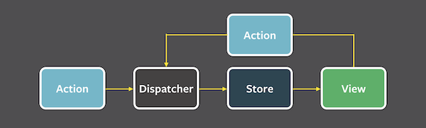

# Step 2.5: Redux: Reducers

[Lessons](../) | [Exercise](./exercise/) | [Demo](./demo/)

Redux is an implementation of the Flux architectural pattern:



Ideally React gives us a mental model of:

```
f(data) => view
```

And it renders when data changes. However, in the real world, data is shaped like a tree and view is shaped like a tree. They don't always match. There are many approaches to Flux, but Redux promotes the data into a singleton state tree that listens for messages to manipulate the state as appropriate.

## View

These are the React Components that consume the store as its data. There is a special way Redux will map its data from the state tree into the different React Components. The Components will know to re-render when these bits of state are changed.

## Store

This is a singleton state tree. The state tree is immutable and needs to be re-created at every action. This helps connected views to know when to update itself - just doing a simple reference comparison rather than a deep comparison.

## Action

Actions are messages to be dispatched to the store to let reducers to change (replace reference of) the state tree.

## Reducers

These are simple stateless, pure functions that takes state + action message and returns a copy of state some modifications according to the action message type and payload.

## Dispatcher

There is a single dispatcher. It simply informs of the store of all the actions that needs to be performed. Certain middleware can be applied to the store and the dispatcher's job is to dispatch the message through all the middleware layers.

Redux is used inside many large and complex applications because of its clarity and its predictability. It is really easy to debug and is easily extensible via its middleware architecture. In this exercise, we'll explore the heart of how Redux modifies state.

Redux uses what is called a "reducer" to modify its state. It is called this because a "reducer" is what is used inside an `Array.reduce()`.

A reducer is a **pure function** that receives some state and an action message as inputs and generates a copy of modified state as the output. Redux manages state changes mainly through reducers, and they are directly related to the UI, so for this exercise, we'll have to use jest tests to see the inner workings.

From the official documentation site:

> Reducers are just pure functions that take the previous state and an action, and return the next state. Remember to return new state objects, instead of mutating the previous state.

# Exercise

1. First, take a look at the store interface in the `exercise/src/store/index.tsx` - note that the `Store` interface has two keys: `todos` and `filter`. We'll concentrate on the `todos` which is an object where the keys are IDs and the values are of an `TodoItem` type.

2. Open `exercise/src/reducers/pureFunctions.ts` and fill in the missing body of the pure functions.

3. Open `exercise/src/reducers/index.ts` and fill in the missing case statements for the switch of `action.type`.

4. Open `exercise/src/reducers/pureFunctions.spec.ts` and implement tests for the functions you wrote for `remove`, `complete`, and `clear`.
