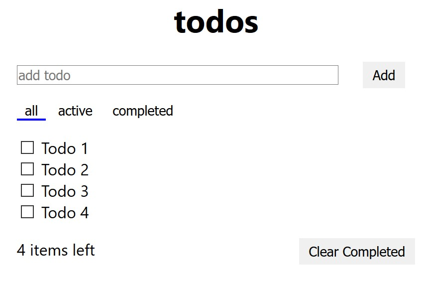

# Step 1.1 - Introduction to HTML (Demo)

## How the web works

A simple web page is rendered on the screen via the following steps.

> There are many sub-steps in this process, but these are the highlights.

1. You instruct the browser which web page you'd like to see
2. The browser looks up the site on a DNS server
   - This is like a big phone book for website server addresses
3. The browser asks the server to send over a specific page of the website, such as `developer.mozilla.org/filename.html` or `developer.mozilla.org`
   - If asked for a "root"-level address, most servers will return `<root>/index.html`
4. The server sends the HTML file back to the browser
5. The browser starts to read the HTML file from the top to the bottom, stopping any time that additional resources are required:
   - CSS stylesheets
   - JavaScript files
   - Fonts
   - Images
6. Browser makes requests for additional resources
   - Those resources might request even more files
7. Once the browser gets to the bottom of the page it can start working on rendering, and then display the page


## HTML demo

HTML tags are the basis of all web applications. They give the page structure and define the content within.

An HTML tag takes the following form:

```html
<tag class="foo" onclick="myFunction()" otherAttributes="values"> </tag>
```

HTML tags can also be nested to create a tree that we call the [Document Object Model](https://developer.mozilla.org/en-US/docs/Web/API/Document_Object_Model/Introduction).

The [HTML demo page](https://microsoft.github.io/frontend-bootcamp/step1-01/demo) shows a large collection of HTML elements that you will come across during development. The full list of elements can be found on [MDN](https://developer.mozilla.org/en-US/docs/Web/HTML/Element).

## Sample webpage

```html
<!DOCTYPE html>
<html>
  <head>
    <title>Frontend Workshop: By Micah Godbolt and Ken Chau</title>
    <link rel="stylesheet" href="./style.css" />
  </head>
  <body>
    <header>
      <h1>Frontend Workshop</h1>
      <nav>
        <ul>
          <li><a href="./about.html">About This Workshop</a></li>
          <li><a href="./participate.html">Take This Workshop</a></li>
          <li><a href="./contribute.html">Contribute to This Workshop</a></li>
        </ul>
      </nav>
    </header>
    <main>
      <h2>About This Workshop</h2>
      <p>
        The first day provides an introduction to the fundamentals of the web: HTML, CSS and JavaScript.
      </p>
      
      <p>
        On the second day we'll dive into more advanced topics like TypeScript, testing, and state management.
      </p>
    </main>
    <footer>
      <h2>Get More Information</h2>
      <ul>
        <li><a href="https://github.com/Microsoft/frontend-bootcamp"> Frontend Bootcamp </a></li>
        <li><a href="https://twitter.com/micahgodbolt"> @micahgodbolt </a></li>
        <li><a href="https://twitter.com/kenneth_chau"> @kenneth_chau</a></li>
      </ul>
    </footer>
  </body>
</html>
```
