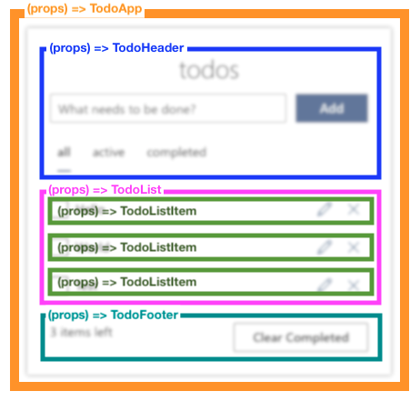

# Step 2.4 - React Context (Demo)

[Lessons](../../) | [Exercise](../exercise/)

In this step, we describe some problems we encounter when creating a more complex application.

We will solve these problems with the [React Context API](https://reactjs.org/docs/context.html). The Context API consists of Provider and Consumer components. Let's take a look at what is in this step:

1. The problem of complex applications
2. React Context API
3. Consuming context from a class component
4. Consuming context from a functional component

## The problem of complex applications

React represents a single component like this:

```
(props) => view;
```

In a real application, these functions are composed. It looks more like this:



Being able to compose components is helpful, but it introduces some complexity:

1. Data needs to be passed down from component to component via props--even if some of the intermediate components don't need to know about some of the data. This is a problem called **props drilling**.

2. Shared data can be changed by various actors (user interaction, updates from server), and there is no coordination of these changes. This makes propagating updates between components challenging.

Even in our simple application, we saw this problem. For example, `<TodoList>` has this props interface:

```ts
interface TodoListProps {
  complete: (id: string) => void;
  remove: (id: string) => void;
  todos: Store['todos'];
  filter: FilterTypes;
  edit: (id: string, label: string) => void;
}
```

None of these props are used in the `TodoList` itself; they're only passed down to child `TodoListItem` components:

```js
<TodoListItem todos="{todos}" complete="{complete}" remove="{remove}" edit="{edit}" />
```

## React Context API

Let's solve these problems with the [React Context API](https://reactjs.org/docs/context.html). Context is React's way to share data from components with their child components without explicitly passing it down through props at every level of the tree. In simpler terms, it solves the props drilling issue mentioned above!

React context is created by calling `createContext()` with some initial data. Use the `<TodoContext.Provider>` component to wrap a part of the component tree that should be handed the context.

### Providing context with `<TodoContext.Provider>`

```js
// To create an empty context
const TodoContext = React.createContext(undefined);

class TodoApp extends React.Component {
  render() {
    // Pass in some state and functions to the provider's value prop
    return (
      <TodoContext.Provider
        value={{
          ...this.state,
          addTodo: this._addTodo,
          setFilter: this._setFilter,
          /* same goes for remove, complete, and clear */
        }}>
        <div>
          <TodoHeader />
          <TodoList />
          <TodoFooter />
        </div>
      </TodoContext.Provider>
    );
  }
}
```

### Consume context from a class component

Inside a class-based child component, such as `<TodoHeader>`, the context created in the parent can be accessed via `this.context`. Note that for this to work, you must also set the component class's `contextType` property to the context type created above.

```js
class TodoHeader extends React.Component {
  render() {
    // Step 1: use the context prop
    return <div>Filter is {this.context.filter}</div>;
  }
}

// Step 2: be sure to set the contextType property of the component class
TodoHeader.contextType = TodoContext;
```

### Consume context from a functional component

If you're using the functional component syntax, you can access the context with the `useContext()` hook:

```js
const TodoFooter = props => {
  const context = useContext(TodoContext);
  return (
    <div>
      <button onClick={context.clear()}>Clear Completed</button>
    </div>
  );
};
```

> Note that `useContext()` requires a recent release of React (16.8+)

There is another legal syntax for accessing context with the `<TodoContext.Consumer>`, but we'll leave that out as an exercise for you!
