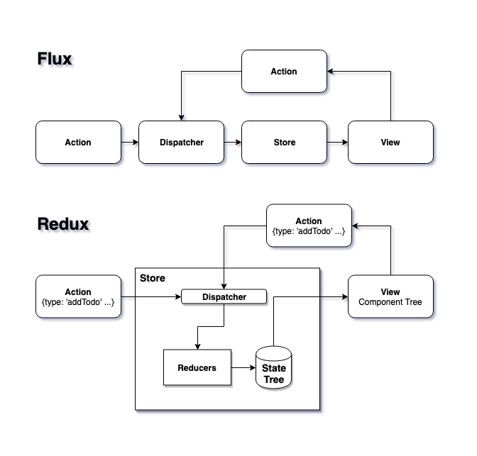

# Step 2.5 - Redux: The Store (Demo)

[Lessons](../../) | [Exercise](../exercise/)

In this step, we will look at solving the problems of complex applications (as mentioned in Step 4) with a library called [Redux](https://redux.js.org).

1. Introduction to Redux
2. Why use Redux?
3. Creating the Redux store
4. Writing reducers
5. Dispatching actions

## Introduction to Redux

As a reminder, the problems that we want to address are:

1. Data needs to be passed down from component to component via props, even when some intermediate components don't use all of the data.
2. Shared data can be changed by various actors (user interaction, updates from server), and there is no coordination of these changes.

Redux is an implementation of the Flux architectural pattern:



### View

A view is a React component that consumes the store as its data.

### Actions

[Actions](https://redux.js.org/basics/actions) are serializable JSON messages that represent some event, such as a user's action or a network request. With the aid of **reducers**, they affect the overall state. At minimum, an action should contain a `type` key. Sometimes it contains additional data as a **payload**.

### Store

The [store](https://redux.js.org/basics/store) consists of a **state tree**, a **dispatcher**, and **reducers**.

1. The **state tree** is a _singleton_, _serializable_, _immutable_ nested JSON structure. It is updated from one snapshot to another using reducers.

2. The [**dispatcher**](https://redux.js.org/basics/data-flow) accepts actions, passing them to the reducers.

3. [**Reducers**](https://redux.js.org/basics/reducers) are functions that take in the current state tree and an action, producing the next snapshot of the state tree. This is the only way to update the state tree.

## Why use Redux?

There are lots of alternatives available, but here are some really good reasons to go with Redux:

1. For more complex applications, Flux pattern forces code to be written in a way that is easy to reason about
2. There may be a need to serialize the application state to be transmitted across the network somehow
3. Dev tooling is really amazing
4. Popularity of the framework means the ecosystem is mature at this point

## Using Redux

### Creating the Redux store

The [`createStore()`](https://redux.js.org/api/createstore) function is provided by Redux to create a store. In general, an application has a single store. The function typically takes in the main reducer and an initial snapshot of the state tree.

```ts
const store = createStore(reducer, initialState);
```

### Writing reducers

We'll write our reducers with the help of some utilities from the official [`redux-starter-kit`](https://redux-starter-kit.js.org/), which greatly decreases the amount of boilerplate needed. The process for designing and implementing reducers is as follows:

#### 1. Organize reducers according to the keys of the state tree object

Given a state tree shaped like this:

```ts
{
  todos: {
    [id: string]: TodoItem,
  },

  filter: 'all' | 'complete' | 'active'
}
```

We would organize our reducers matching the keys of the state tree and combine them with [`combineReducers()`](https://redux.js.org/recipes/structuring-reducers/using-combinereducers):

```ts
import { createReducer } from 'redux-starter-kit';
import { combineReducers } from 'redux';

const reducer = combineReducers({
  todos: createReducer({}, {
    addTodo: (state, action) => { /* ... */ }
  }),
  filter: createReducer('all', {
    setFilter: (state, action) => { /* ... */ }
  })
})
```

#### 2. Write the reducers with mutables

In plain Redux, reducers must make a copy of the state before making modifications, but [`createReducer()`](https://redux-starter-kit.js.org/api/createreducer) will automatically translate all the mutations to the state into immutable snapshots (!!!!!):

```ts
// first argument: initial state
// second argument: object whose keys correspond to possible values of action.type
const todosReducer = createReducer(
  {},
  {
    addTodo: (state, action) => {
      state[action.id] = { label: action.label, completed: false };
    }
  }
);
```

### Dispatching actions

Dispatching an action will pass the action and the current state to the reducers. The root reducer will produce a new snapshot of the entire state tree. We can inspect the affected snapshot with the help of `getState()`.

```ts
const store = createStore(reducer, initialState);
store.dispatch({ type: 'addTodo', label: 'hello' });
store.dispatch({ type: 'addTodo', label: 'world' });
console.log(store.getState());
```

Creating these action messages by hand is tedious, so we use action creators to do that:

```ts
const actions = {
  addTodo = (label: string) => ({ label, id: nextId(), completed: false })
};

store.dispatch(actions.addTodo('hello'));
```
